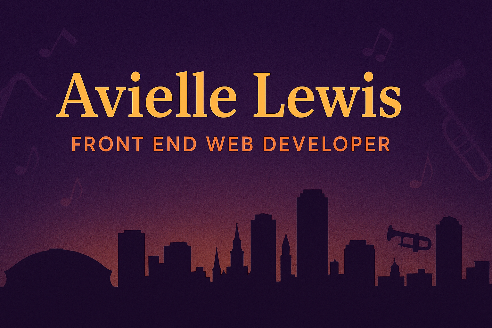

<!-- Banner -->

  

<!-- Title -->
<h1 align="center">Hi, I'm Avielle Lewis 👋</h1>

<h3 align="center">✨ Front-End Web Developer | Aspiring Full-Stack ✨</h3>

---

### 🎭 About Me  

I'm a **Front-End Web Developer** passionate about creating vibrant, dynamic, and user-friendly websites.  
With roots in **New Orleans**, I bring the energy of the city — **bold, soulful, and creative** — into every project.  

- 💻 Currently working on: My **Portfolio Website**  
- 🚀 Learning: **Next.js, Node.js, and backend development** to become full-stack  
- 🎨 Favorite tools: React, TailwindCSS, JavaScript  
- 🎶 Fun fact: I design with the rhythm of **jazz & bounce beats in mind** 🎷  

---

### 🛠️ Tech Stack  

**Frontend**  
  
  
  
  

**Backend (learning)**  
  
  
  

---

### 🌆 Featured Projects  

🚧 **Coming Soon** — Check out my [Portfolio Website](https://perfect-portfolio-nine.vercel.app/) for updates!  

---

### 📫 Connect with Me  

  
  
  

---

  <i>“Code with soul. Design with rhythm.”</i>

<!--
**aviselanj/aviselanj** is a ✨ _special_ ✨ repository because its `README.md` (this file) appears on your GitHub profile.

Here are some ideas to get you started:

- 🔭 I’m currently working on ...
- 🌱 I’m currently learning ...
- 👯 I’m looking to collaborate on ...
- 🤔 I’m looking for help with ...
- 💬 Ask me about ...
- 📫 How to reach me: ...
- 😄 Pronouns: ...
- ⚡ Fun fact: ...
-->
